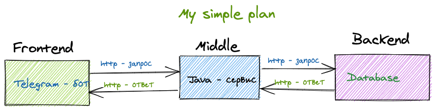
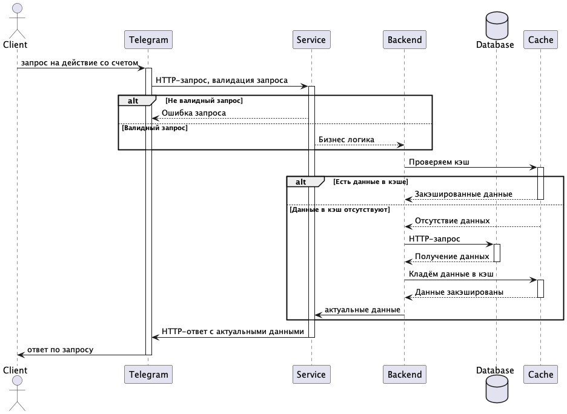

# Middle-Service from GPB-IT-FACTORY "Мини-банк"

__Middle-Service приложения "Мини-банк", который будет:__

- принимать запросы от "Telegram-bot";
- выполнять валидацию и бизнес логику;
- маршруризировать запросы в Backend (АБС).



### Архитектура уровней



### Локальный запуск

1. __Склонируйте репозиторий:__
   ```git clone https://github.com/gpb-it-factory/artemyev-telegram-bot.git ```
2. __Получите API-токен для Telegam-бота__, следуйте инструкциям
   на: <https://core.telegram.org/bots/tutorial#obtain-your-bot-token>
3. __Убедитесь, что у вас установлены__: Java 17, Gradle 8.7
4. __Сборка проекта__: в терминале выполните команду:  ``` gradle bootJar ``` Это соберет исполняемый JAR-файл в
   папке `build/libs`
5. __Запуск приложения__: ``` java -jar build/libs/artemyev-telegam-bot-0.0.1-SNAPSHOT.jar```

### Дальнейшие шаги по использованию сервиса...

...

### Контакты

- **Telegram:** [@nicknickart](https://t.me/nicknickart)   :blush:
- **GitHub:** [Nickola89](https://github.com/gpb-it-factory/artemyev-middle-service) 

